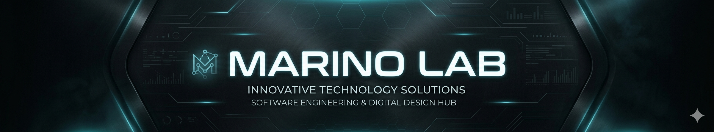
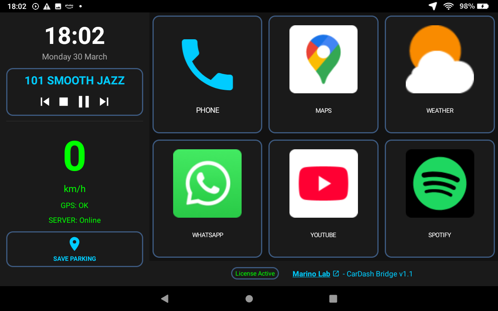
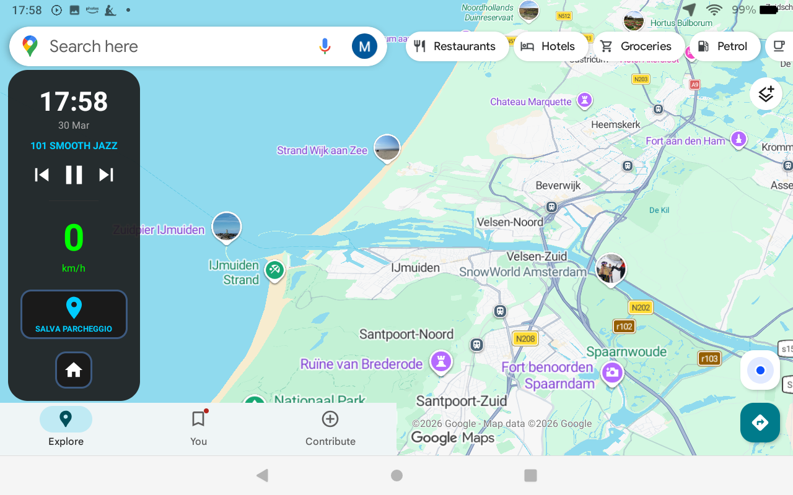
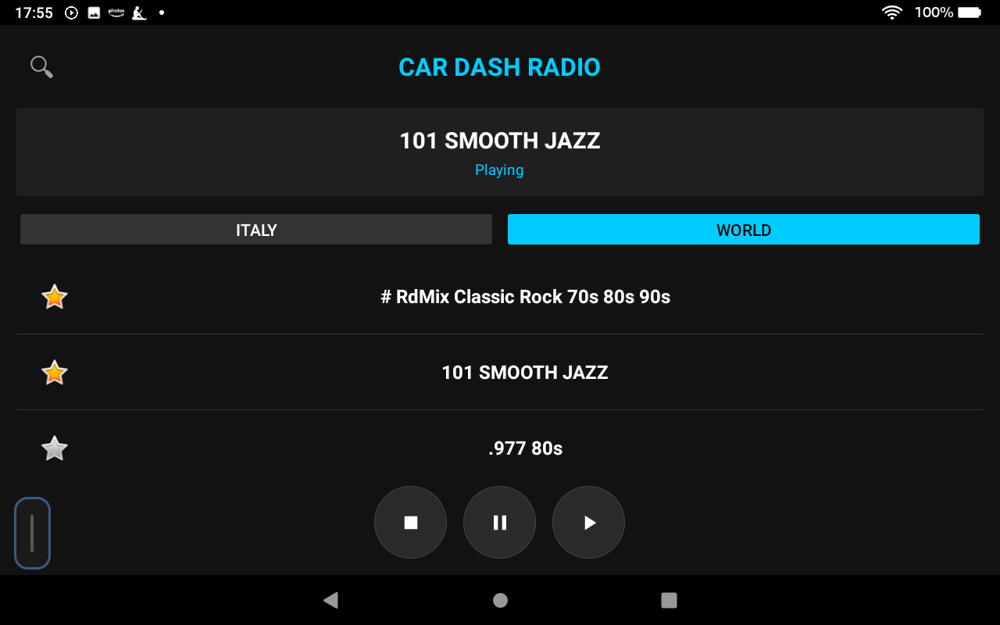
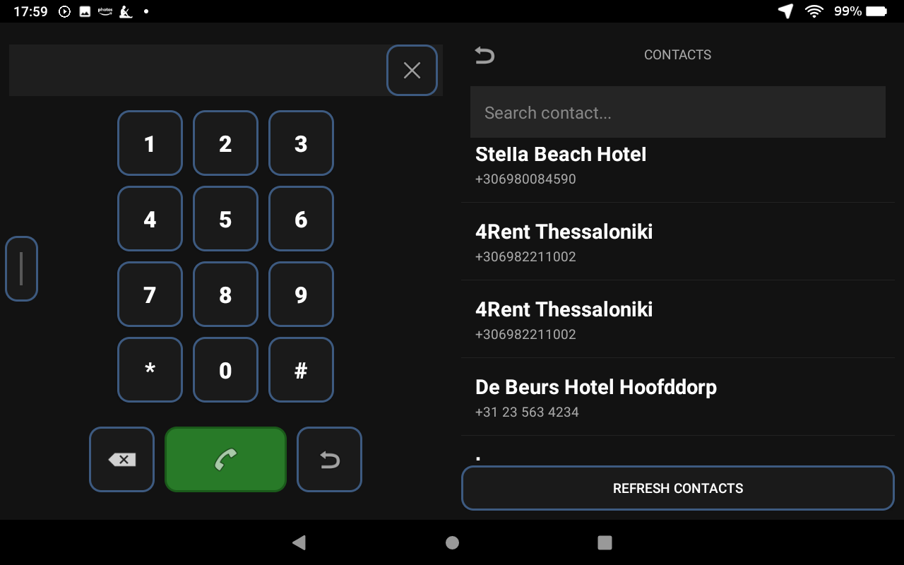
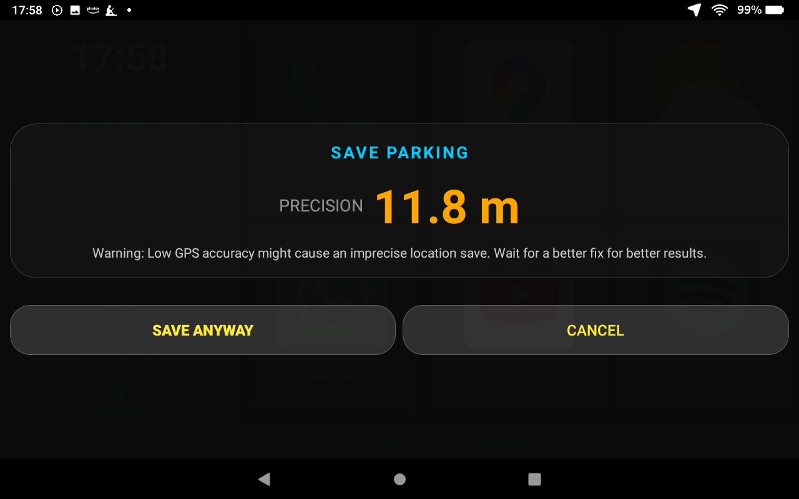
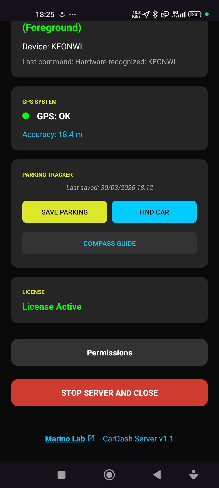
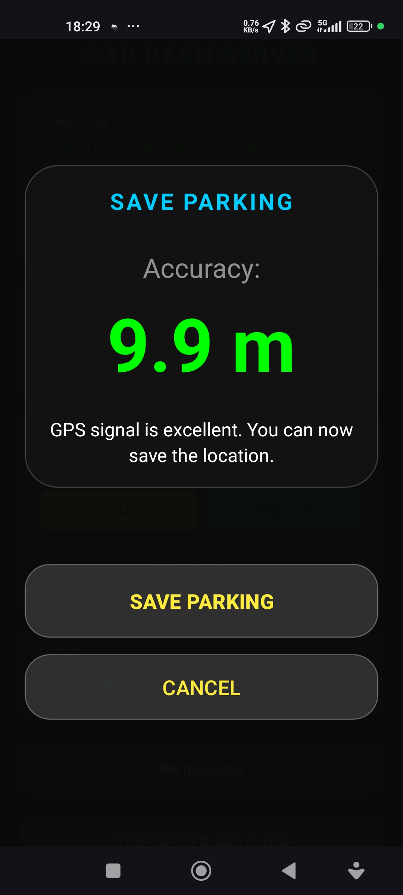
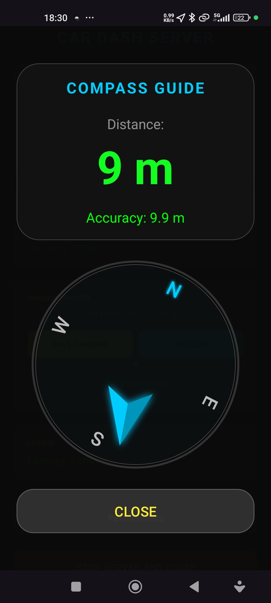
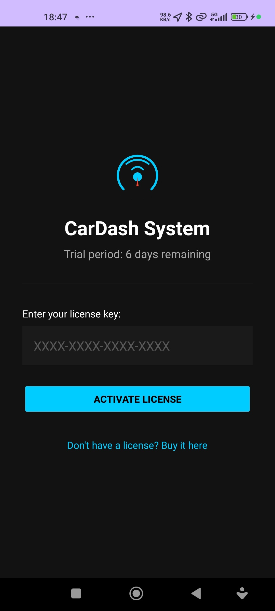

> 🇮🇹 [Leggi in Italiano](README_IT.md) | 🇬🇧 Reading in English

# 🚗 CarDash System
### Android Infotainment & Phone Gateway

> Turn your smartphone and a tablet into a professional in-car infotainment system — no hardware modifications required.

---

## 📸 Screenshots

### Main Dashboard (Tablet)
> Digital speedometer, active radio, app shortcuts and parking save — everything at a glance.

### Google Maps + Floating Sidebar
> The tablet uses the phone's GPS to run Google Maps or Waze — even without hardware GPS. The floating sidebar stays always accessible.

### Integrated Web Radio
> Thousands of Italian and worldwide stations, favorites and play/pause controls — without leaving the dashboard.

### Call Management
> Dialpad and contacts synced directly from the phone, optimized for driving.

### Save Parking (Tablet Dialog)
> The system shows real-time GPS accuracy and warns you if the signal is weak before saving.

---

### Server App (Smartphone)

| Main Panel | Save Parking | Compass Guide |
|---|---|---|
|  |  |  |

> The **Compass Guide** shows the direction and exact distance to your parked car.

### License Activation

---

## ✨ Key Features

### 📱 Server App — on your smartphone
- **TCP/UDP Gateway** — streams GPS, speed and notifications to the tablet in real time
- **Notification mirroring** — WhatsApp, Maps and other apps appear on the dashboard
- **Call management** — initiate calls even over the lock screen
- **Parking Tracker** — saves your position with metric precision and guides you back to your car via compass

### 🖥️ Bridge App — on the tablet in your car
- **Digital speedometer** — speed in km/h with GPS and server connection status
- **Mock GPS** — injects the phone's GPS signal into the tablet, enabling Google Maps and Waze even without hardware GPS
- **Web Radio** — thousands of stations via Radio-Browser API with favorites management
- **Floating Sidebar** — always-visible sidebar with quick controls
- **Auto-discovery** — connects to the phone as soon as it detects the Wi-Fi hotspot
- **Smart Auto-Save Parking** — intelligent algorithm that detects the end of a journey (speed 0 km/h for 15s after exceeding 15 km/h) and automatically sends the save command to the Server with visual feedback

---

## 🎬 Video Guides

| | 🇮🇹 Italiano | 🇬🇧 English |
|---|---|---|
| 📱 Server Installation | [Guarda su YouTube](https://youtu.be/RtZ0KoxagCQ) | [Watch on YouTube](https://youtu.be/iZDD6ckDfog) |

---

## 🚀 Getting Started

### Requirements
- An **Android smartphone** (minSdk 21 / Android 5.0+) with SIM card
- An **Android tablet** (or Android head unit) mounted in the car
- A Wi-Fi connection shared from the smartphone (hotspot)

### Installation — 3 steps

**1. Download the apps**

| App | Device | Link |
|---|---|---|
| `CarDash Server` | 📱 Smartphone | [⬇ Download APK](https://github.com/marinolabtech/CarDash/releases/latest) |
| `CarDash Bridge` | 🖥️ Tablet | [⬇ Download APK](https://github.com/marinolabtech/CarDash/releases/latest) |

**2. Grant permissions**

Both apps guide the user through an interactive flow for the required permissions (overlay, notifications, location, calls). Each permission is explained with the reason it is needed.

**3. Connect**

Enable Wi-Fi hotspot on the smartphone → launch CarDash Server → launch CarDash Bridge on the tablet. The connection happens automatically.

---

## 🔑 License & Pricing

**The apps are free to download.** Use the links above to get the APKs directly from GitHub.

The system includes a **free 7-day trial** with all features enabled. No credit card required.

After the trial, purchase your license key at:

👉 **[marinolab.lemonsqueezy.com](https://marinolab.lemonsqueezy.com/)**

**No reinstallation needed.** After purchase you will receive an email containing your license key in the format `XXXX-XXXX-XXXX-XXXX`. Enter it in the Server app under **"Activate License"** — it will be automatically synced to the tablet as well.

> ⚠️ **Anti-reset**: the trial protection system is designed to resist date resets or reinstallations.

---

## ❓ FAQ

**Does the tablet need GPS?**
No. CarDash injects the phone's GPS signal into the tablet's Android system, enabling Google Maps and Waze even on tablets without hardware GPS.

**Does it work with any Android tablet?**
Yes, from Android 5.0 onwards. Optimized for landscape use.

**Why are so many permissions required?**
Each permission has a specific purpose: overlay is needed for the floating sidebar over Maps, notifications for mirroring, location for GPS and the parking tracker, calls for the dialpad. No data is sent to external servers.

**Does it work without an internet connection?**
The dashboard, speedometer, calls and parking tracker work completely offline. Web radio and update checks require internet.

**How do I receive updates?**
The app automatically checks for new versions on GitHub at startup and displays a notification with the changelog if one is available.

---

## 📡 Communication Protocol

| Port | Protocol | Usage |
|---|---|---|
| `8080` | TCP | Commands, contacts, notifications, license |
| `8888` | UDP | Discovery beacon, GPS telemetry |

---

## 🏗️ Project Architecture

The project is a **multi-module Gradle system**:

- **`:app-server`** — Foreground Service with UDP beacon, TCP server, GPS telemetry and notification listener
- **`:app-bridge`** — Driving-optimized UI with mock GPS, Media3/ExoPlayer radio and floating sidebar
- **`:common`** — Shared library with `LicenseManager` and communication constants

**Tech stack:** Kotlin · Android SDK 36 · Media3/ExoPlayer · Radio-Browser API · Lemon Squeezy

---

## 🛠️ Build & Release

### Development requirements
- Android Studio Hedgehog or higher
- Android SDK minSdk 21, targetSdk 36
- Foreground Service Types declared: `connectedDevice`, `location`, `mediaPlayback`

---

**Developed by [Marino Lab](https://marinolab.lemonsqueezy.com/) · CarDash System v1.1 · Last updated: March 28, 2026**
