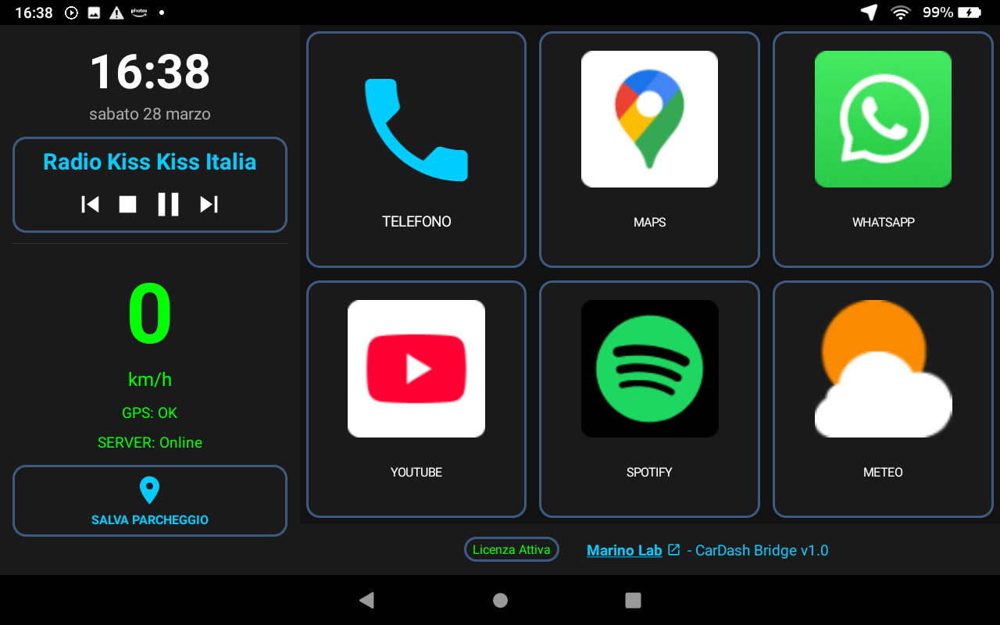
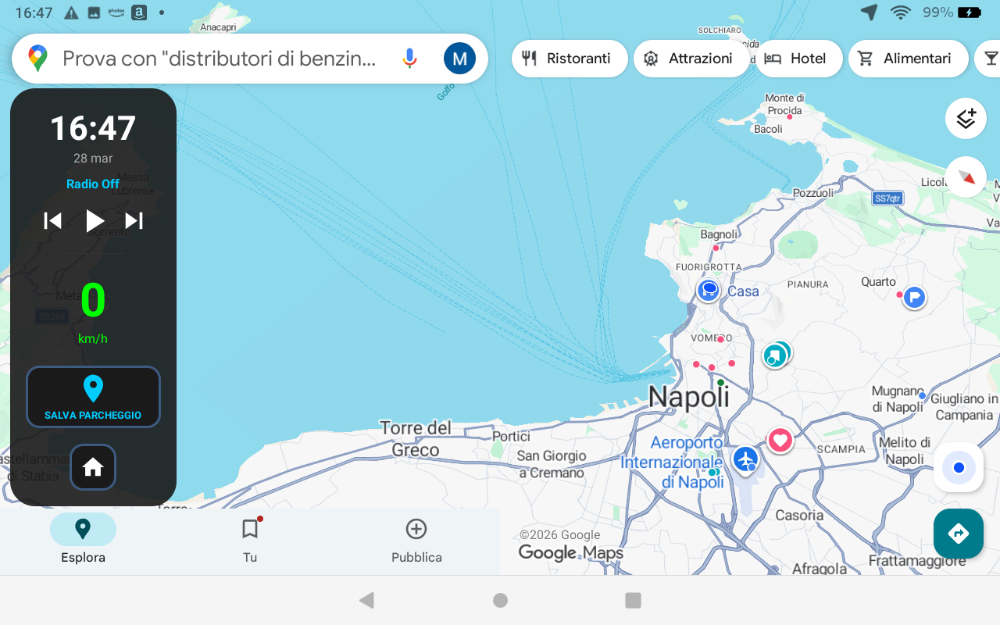
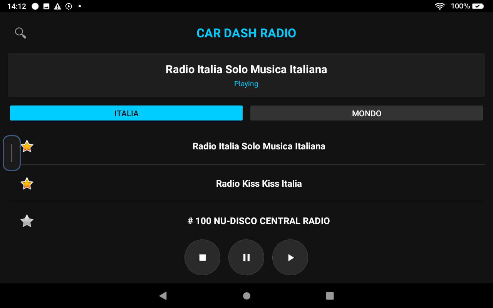
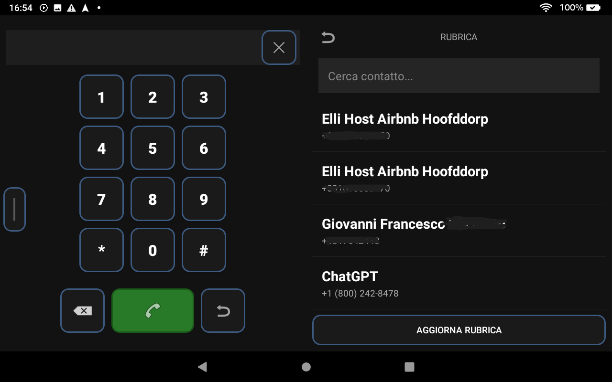
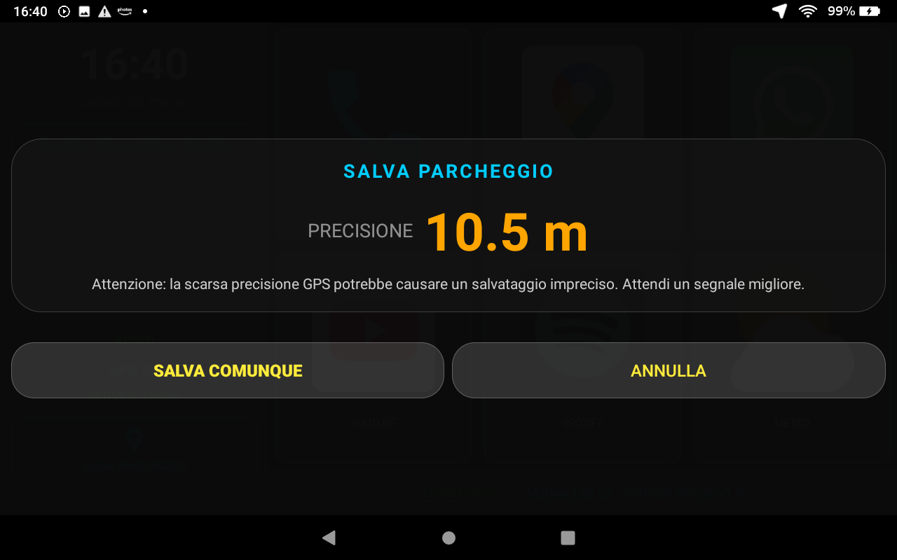
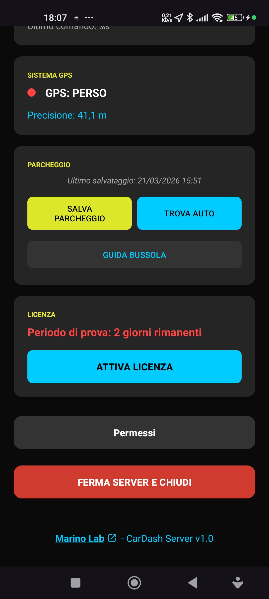
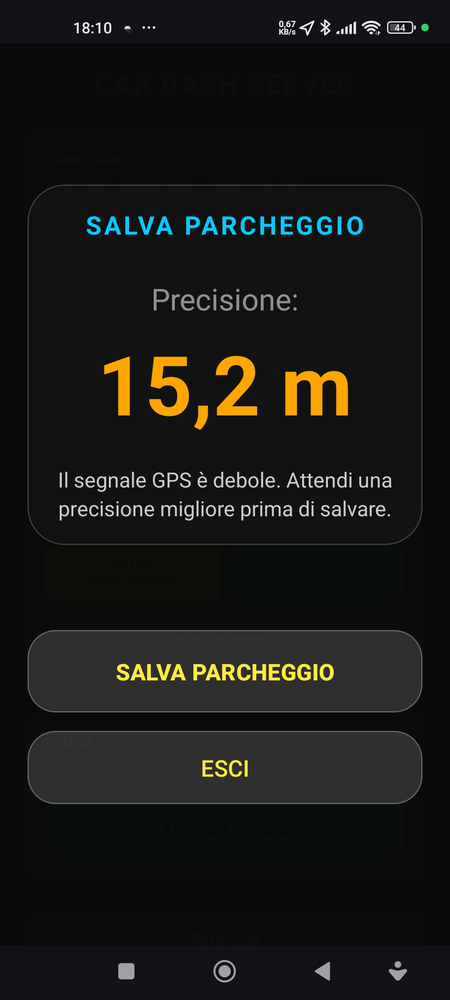
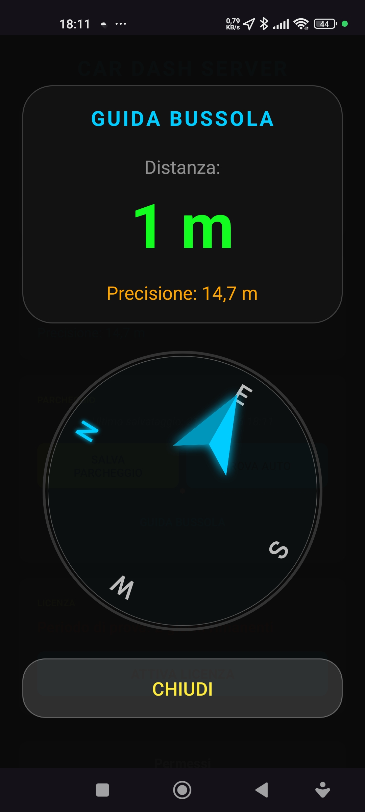
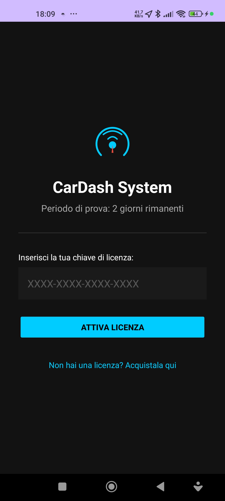

> 🇬🇧 [Read in English](README.md) | 🇮🇹 Stai leggendo in Italiano

# 🚗 CarDash System
### Android Infotainment & Phone Gateway

> Trasforma il tuo smartphone e un tablet in un sistema di infotainment professionale per l'auto — senza modifiche hardware.

---

## 📸 Anteprima

### Dashboard Principale (Tablet)
> Tachimetro digitale, radio attiva, scorciatoie alle app e salvataggio parcheggio — tutto in un colpo d'occhio.

### Google Maps + Floating Sidebar
> Il tablet usa il GPS del telefono per navigare con Google Maps o Waze — anche senza GPS hardware. La barra laterale flottante rimane sempre accessibile.

### Radio Web Integrata
> Migliaia di stazioni italiane e mondiali, preferiti e controlli play/pausa — tutto senza uscire dalla dashboard.

### Gestione Chiamate
> Tastierino e rubrica sincronizzata direttamente dal telefono, ottimizzati per la guida.

### Salva Parcheggio (Dialogo Tablet)
> Il sistema mostra la precisione GPS in tempo reale e ti avvisa se il segnale è scarso prima di salvare.

---

### App Server (Smartphone)

| Pannello Principale | Salva Parcheggio | Guida Bussola |
|---|---|---|
|  |  |  |

> La **Guida Bussola** ti indica la direzione e la distanza esatta dalla tua auto parcheggiata.

### Attivazione Licenza

---

## ✨ Funzionalità Principali

### 📱 App Server — sul tuo smartphone
- **Gateway TCP/UDP** — trasmette GPS, velocità e notifiche al tablet in tempo reale
- **Mirroring notifiche** — WhatsApp, Maps e altre app appaiono sulla dashboard
- **Gestione chiamate** — avvio chiamate anche sopra il lock screen
- **Parking Tracker** — salva la posizione con precisione metrica e ti riporta all'auto tramite bussola grafica

### 🖥️ App Bridge — sul tablet in auto
- **Tachimetro digitale** — velocità in km/h con stato GPS e connessione server
- **Mock GPS** — inietta il segnale del telefono nel tablet, abilitando Google Maps e Waze anche senza GPS hardware
- **Radio Web** — migliaia di stazioni via Radio-Browser API con gestione preferiti
- **Floating Sidebar** — barra laterale sempre visibile con controlli rapidi
- **Discovery automatica** — si connette al telefono non appena riconosce l'hotspot Wi-Fi
- **Smart Auto-Save Parking** — algoritmo intelligente che rileva la fine di un tragitto (velocità 0 km/h per 15s dopo aver superato i 15 km/h) e invia automaticamente il comando di salvataggio al Server con feedback visivo

---

## 🎬 Video Guide

| | 🇮🇹 Italiano | 🇬🇧 English |
|---|---|---|
| 📱 Installazione Server | [Guarda su YouTube](https://youtu.be/RtZ0KoxagCQ) | [Watch on YouTube](https://youtu.be/iZDD6ckDfog) |
| 🖥️ Installazione Client | [Guarda su YouTube](https://youtu.be/ginWiQasmFY) | [Watch on YouTube](https://youtu.be/OWTKOR-zTcw) |

---

## 🚀 Come Iniziare

### Requisiti
- Uno **smartphone Android** (minSdk 21 / Android 5.0+) con SIM
- Un **tablet Android** (o autoradio Android) da montare in auto
- Una connessione Wi-Fi condivisa dallo smartphone (hotspot)

### Installazione — 3 passi

**1. Scarica le app**

| App | Dispositivo | Link |
|---|---|---|
| `CarDash Server` | 📱 Smartphone | [⬇ Download APK](https://github.com/marinolabtech/CarDash/releases/latest) |
| `CarDash Bridge` | 🖥️ Tablet | [⬇ Download APK](https://github.com/marinolabtech/CarDash/releases/latest) |

**2. Concedi i permessi**

Entrambe le app guidano l'utente tramite un flow interattivo per i permessi necessari (overlay, notifiche, posizione, chiamate). Ogni permesso è spiegato con il motivo per cui serve.

**3. Connetti**

Attiva l'hotspot Wi-Fi sullo smartphone → avvia CarDash Server → avvia CarDash Bridge sul tablet. La connessione avviene in automatico.

---

## 🔑 Licenza & Prezzi

**Le app sono gratuite da scaricare.** Usa i link sopra per ottenere gli APK direttamente da GitHub.

Il sistema include un **trial gratuito di 7 giorni** con tutte le funzionalità attive. Nessuna carta di credito richiesta.

Al termine del trial, puoi acquistare la chiave di licenza su:

👉 **[marinolab.lemonsqueezy.com](https://marinolab.lemonsqueezy.com/)**

**Non è necessario scaricare o reinstallare nulla.** Dopo l'acquisto riceverai una mail con la tua chiave di licenza nel formato `XXXX-XXXX-XXXX-XXXX`. Inseriscila nell'app Server alla voce **"Attiva Licenza"** — verrà sincronizzata automaticamente anche sul tablet.

> ⚠️ **Anti-reset**: il sistema di protezione del trial è progettato per resistere a reset della data o reinstallazioni.

---

## ❓ FAQ

**Il tablet ha bisogno del GPS?**
No. CarDash inietta il segnale GPS del telefono nel sistema Android del tablet, permettendo l'uso di Google Maps e Waze anche su tablet senza GPS hardware.

**Funziona con qualsiasi tablet Android?**
Sì, da Android 5.0 in poi. Ottimizzato per l'uso in orizzontale.

**Perché servono tutti quei permessi?**
Ogni permesso ha uno scopo preciso: l'overlay serve per la sidebar flottante sopra Maps, le notifiche per il mirroring, la posizione per il GPS e il parking tracker, le chiamate per il tastierino. Nessun dato viene inviato a server esterni.

**Funziona senza connessione internet?**
La dashboard, il tachimetro, le chiamate e il parking tracker funzionano completamente offline. La radio web e il controllo aggiornamenti richiedono internet.

**Come ricevo gli aggiornamenti?**
L'app controlla automaticamente la presenza di nuove versioni su GitHub all'avvio e mostra una notifica con il changelog se disponibile.

---

## 📡 Protocollo di Comunicazione

| Porta | Protocollo | Uso |
|---|---|---|
| `8080` | TCP | Comandi, rubrica, notifiche, licenza |
| `8888` | UDP | Beacon discovery, telemetria GPS |

| Comando | Descrizione |
|---|---|
| `GPS_DATA` | Telemetria completa (Lat, Lon, Vel, Alt) |
| `SPEED:VAL:ST` | Velocità e stato connessione |
| `INCOMING` | Chiamata in entrata con nome contatto |
| `LICENSE_SYNC` | Sincronizzazione licenza tra dispositivi |
| `GET_CONTACTS` | Recupero rubrica dal tablet |
| `NOTIFICATION` | Mirroring notifiche app terze |

---

## 🏗️ Architettura del Progetto

Il progetto è un sistema **multi-modulo Gradle**:

- **`:app-server`** — Foreground Service con beacon UDP, server TCP, telemetria GPS e listener notifiche
- **`:app-bridge`** — UI ottimizzata per la guida con mock GPS, radio Media3/ExoPlayer e floating sidebar
- **`:common`** — Libreria condivisa con `LicenseManager` e costanti di comunicazione

**Stack tecnico:** Kotlin · Android SDK 36 · Media3/ExoPlayer · Radio-Browser API · Lemon Squeezy

---

## 🛠️ Build & Release

### Requisiti di sviluppo
- Android Studio Hedgehog o superiore
- Android SDK minSdk 21, targetSdk 36
- Foreground Service Types dichiarati: `connectedDevice`, `location`, `mediaPlayback`

---

**Sviluppato da [Marino Lab](https://marinolab.lemonsqueezy.com/) · CarDash System v1.1 · Ultimo aggiornamento: 28 Marzo 2026**
